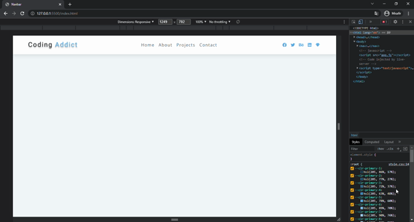

# RESPONSIVE NAVBAR
Created the responsive navbar using the toggle method in this project.



## Used Technologies
* JavaScript
* CSS
* HTML


## Installation
First clone the project.
```
git clone https://github.com/saglamburcu/navbar-project.git
```

## Usage
After cloning the project, open it in Visual Studio Code.
```
cd navbar-project
code .
```